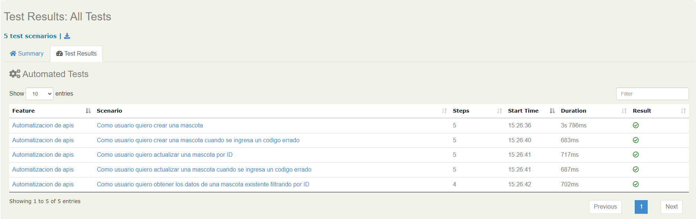

# Demo Automatizacion Apis con Serenity BDD

En el demo se redactan los casos en Gherkin y luego se van mapeando los metodos para acceder a los servicios.

###### Api(servicio) para automatización: https://petstore.swagger.io

#### Ejercicios del Demo

- Agregar una mascota realizando un POST al path /v/pet.
- Realizar un GEt /v2/pet/{pedId} para obtener una mascota existente
- Modificar una mascota existente mediante PUT al path /v2/pet.
- En todos los casos validar: (Status code esperado y Schema del response).


#### Comando para ejecutar y obtener los reportes

```
$ mvn clean verify "-Dcucumber.options=--tags @DemoAutomationApis"
```

#### Config file pom.xml

```
    <properties>
        <serenity.version>2.1.7</serenity.version>
        <serenity.maven.version>2.1.7</serenity.maven.version>
        <serenity.cucumber.version>1.9.51</serenity.cucumber.version>
    </properties>
    
    <dependencies>
        <dependency>
            <groupId>net.serenity-bdd</groupId>
            <artifactId>serenity-rest-assured</artifactId>
            <version>${serenity.version}</version>
        </dependency>
        <dependency>
            <groupId>net.serenity-bdd</groupId>
            <artifactId>serenity-cucumber</artifactId>
            <version>${serenity.cucumber.version}</version>
        </dependency>
        <dependency>
            <groupId>net.serenity-bdd</groupId>
            <artifactId>serenity-core</artifactId>
            <version>${serenity.version}</version>
        </dependency>
        <!-- json -->
        <dependency>
            <groupId>org.json</groupId>
            <artifactId>json</artifactId>
            <version>20190722</version>
        </dependency>

        <dependency>
            <groupId>com.jayway.jsonpath</groupId>
            <artifactId>json-path</artifactId>
            <version>2.2.0</version>
        </dependency>
        <!-- json -->
    </dependencies>
```

## Reportes





